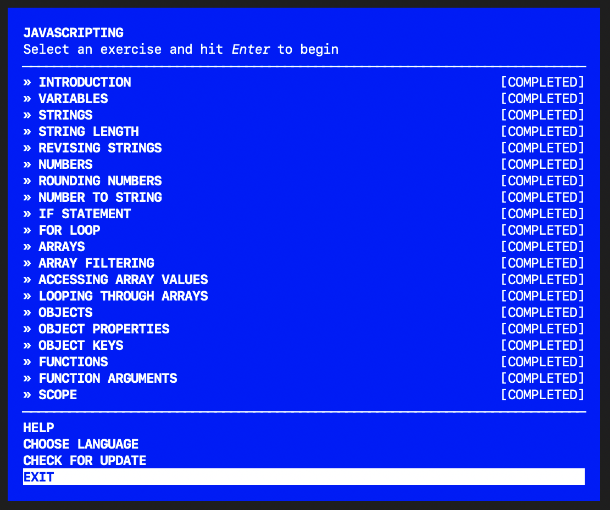

# Javascripting
Interactive coding exercises to learn javascript basics and concepts. 

## Concepts covered as part of this exercise:

## Source 
[Javascripting by nodeschool.io](https://github.com/workshopper/javascripting)

